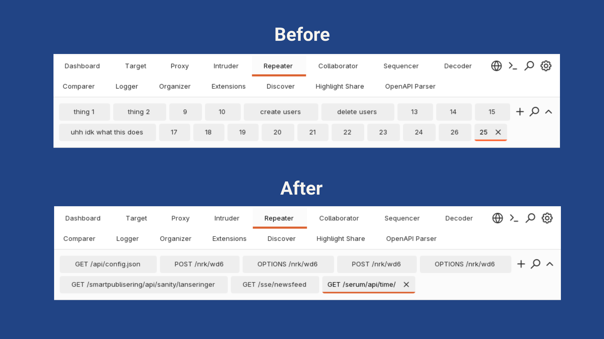

# Repeater Tab Auto-Namer
Burp Suite extension that auto-renames Repeater tabs to `{METHOD} {PATH}`
<p align="center">
    
</p>

## Install

1. Download latest version from Releases
2. Open **Extensions > Installed** in Burp Suite
3. Click **Add**
4. Choose **Java** as the extension type
5. Select the downloaded `.jar` file

> [!IMPORTANT]
> Remember to go to **Settings > User interface > Hotkeys** and remove the existing Ctrl+R assignment.

## Build It Yourself

Requires Java 17 or newer.

```console
$ gradle wrapper
$ ./gradle jar
```

